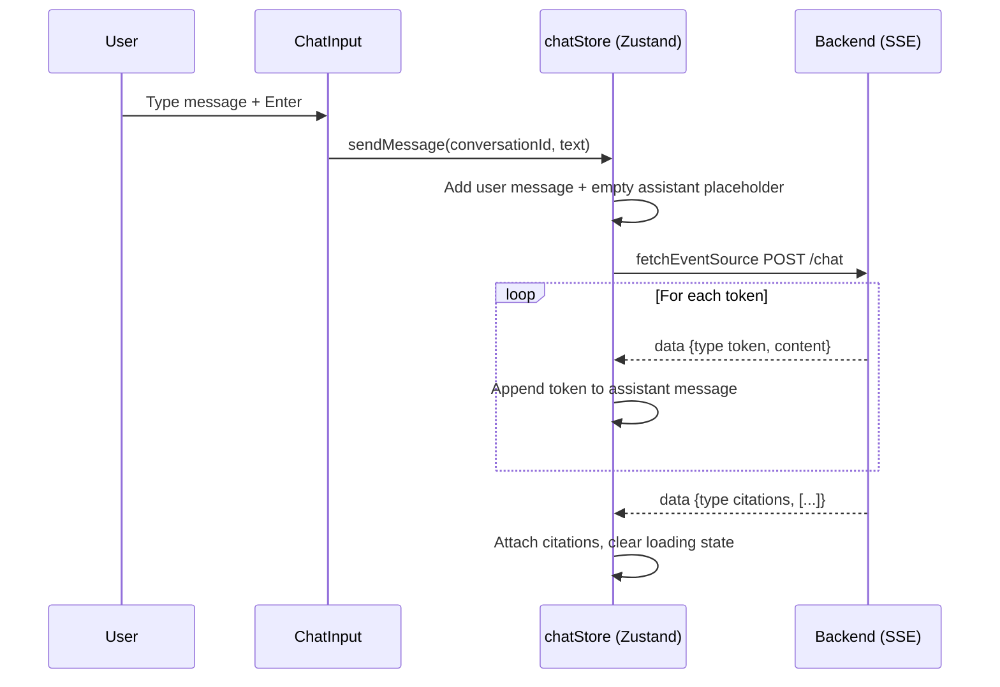

<div align="center">

# Tactica — Frontend

### A sports-only AI chatbot UI with real-time token streaming and multi-conversation management

<p>
  
  
  
  
  
  
</p>

<sub>Frontend repository · <a href="https://github.com/raosam23/tactica-backend">Backend repository →</a></sub>

</div>

---

## Table of Contents

- [What is Tactica?](#what-is-tactica)
- [Features](#features)
- [How streaming works](#how-streaming-works)
- [Tech stack](#tech-stack)
- [Project structure](#project-structure)
- [Getting started](#getting-started)
- [Environment variables](#environment-variables)

---

## What is Tactica?

Tactica is a **sports-only AI chatbot** with a ChatGPT/Claude-like interface. Ask anything about sports — stats, tactics, predictions, debates — and a panel of specialist AI agents discusses it before a Moderator synthesizes the final response, **streamed back to you token by token in real time**.

This is the **frontend repository**. It connects to the [Tactica backend](https://github.com/raosam23/tactica-backend), which runs the multi-agent AutoGen pipeline, RAG retrieval, and PostgreSQL storage.

---

## Features

- **Real-time token streaming** — responses stream word by word over Server-Sent Events, just like ChatGPT
- **Multi-conversation management** — create, switch, and delete conversations from the sidebar, with the active one highlighted
- **Per-message citations** — a collapsible sources panel under each AI response
- **Markdown rendering** — full markdown support for AI responses
- **Animated thinking indicator** — rotating sports-themed status messages while the panel deliberates, hidden the moment streaming begins
- **Conversation memory** — the AI remembers context from earlier messages in the same thread
- **JWT authentication** — register, login, and protected routes via cookie-stored tokens
- **Per-conversation loading state** — sending in one chat never blocks or corrupts another
- **Dark mode** — forced dark theme with a consistent purple-tinted design system

---

## How streaming works

The chat endpoint is not a normal request/response — it is an SSE stream. Auth REST calls still go through Axios; only the streaming chat uses `@microsoft/fetch-event-source`.



The empty assistant message is created up front so streamed tokens have a target to append to. The `citations` event is the signal that the stream is complete.

---

## Tech stack

| Layer            | Choice                                                          |
| ---------------- | -------------------------------------------------------------- |
| Framework        | Next.js 15 (App Router, React 19)                              |
| Language         | TypeScript (strict mode)                                       |
| Styling          | Tailwind CSS v4                                                |
| UI components    | shadcn/ui (`radix-nova` style)                                 |
| State management | Zustand 5                                                      |
| HTTP client      | Axios (REST) + `@microsoft/fetch-event-source` (SSE streaming) |
| Auth             | JWT stored in cookies via `js-cookie`                          |
| Notifications    | notistack                                                      |
| Icons            | lucide-react                                                   |
| Loading spinners | ldrs/react                                                     |
| Markdown         | react-markdown + @tailwindcss/typography                      |
| Package manager  | Bun                                                           |

---

## Project structure

```
src/
├── app/
│   ├── (auth)/
│   │   ├── login/page.tsx              # Login page
│   │   └── register/page.tsx           # Register page
│   ├── (dashboard)/
│   │   ├── layout.tsx                  # Dashboard layout with sidebar
│   │   └── chat/
│   │       ├── page.tsx                # Empty state (no conversation selected)
│   │       └── [conversationId]/
│   │           └── page.tsx            # Active conversation page
│   ├── layout.tsx                      # Root layout, wraps app in Providers
│   └── page.tsx                        # Root redirect (to /chat or /login)
├── components/
│   ├── ui/                             # shadcn components + custom UI
│   │   ├── Providers.tsx               # SnackbarProvider wrapper
│   │   ├── Toast.tsx                   # Custom toast component
│   │   └── Spinner.tsx                 # Loading spinner
│   ├── auth/
│   │   ├── LoginForm.tsx
│   │   └── RegisterForm.tsx
│   └── chat/
│       ├── Sidebar.tsx                 # Conversation list, new chat, user info
│       ├── ChatWindow.tsx              # Message area
│       ├── MessageBubble.tsx           # Individual message rendering
│       ├── ChatInput.tsx               # Input box with Enter-to-send
│       ├── CitationsList.tsx           # Collapsible citations under AI messages
│       └── ThinkingIndicator.tsx       # Animated loading indicator while AI thinks
├── lib/
│   ├── api.ts                          # Axios instance with base URL + auth interceptor
│   ├── error.ts                        # ApiError class for typed error propagation
│   ├── constants.ts                    # Sports-themed thinking messages list
│   └── utils.ts                        # cn() and other helpers
├── stores/
│   ├── authStore.ts                    # Zustand: user, isAuthenticated, login/logout/register
│   └── chatStore.ts                    # Zustand: conversations, messages, streaming state
└── types/
    └── index.ts                        # TypeScript types matching backend schemas
```

---

## Getting started

> Tactica needs **both** repositories. This is the frontend — it expects the [tactica-backend](https://github.com/raosam23/tactica-backend) running on `http://localhost:8000`. Set that up first.

### 1. Prerequisites

- [Bun](https://bun.sh/) — `curl -fsSL https://bun.sh/install | bash`
- The [Tactica backend](https://github.com/raosam23/tactica-backend) running locally

### 2. Clone the repository

```bash
git clone https://github.com/raosam23/tactica-frontend
cd tactica-frontend
```

### 3. Install dependencies

```bash
bun install
```

### 4. Configure environment

Create a `.env.local` file in the project root:

```env
NEXT_PUBLIC_API_URL=http://localhost:8000/api
```

### 5. Start the development server

```bash
bun dev
```

Open [http://localhost:3000](http://localhost:3000) in your browser.

### 6. Other commands

```bash
bun build    # production build
bun start    # serve production build
bun lint     # run ESLint
```

---

## Environment variables

| Variable              | Required | Description                                                          |
| --------------------- | :------: | ------------------------------------------------------------------- |
| `NEXT_PUBLIC_API_URL` |   Yes    | Base URL of the Tactica backend API (e.g. `http://localhost:8000/api`) |

> In Next.js, any variable exposed to the browser must be prefixed with `NEXT_PUBLIC_`.

---

<div align="center">
  <sub>Built for sports conversations that feel <b>opinionated, informed, and context-aware</b>.</sub>
</div>
